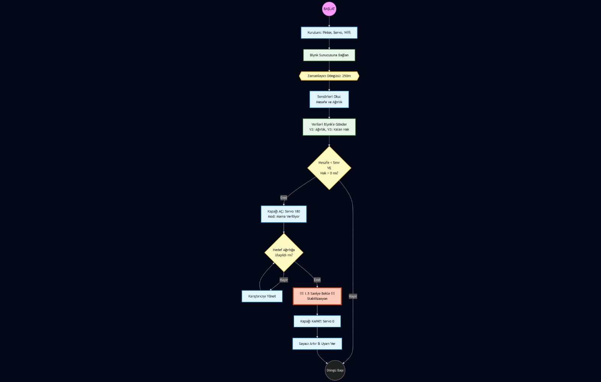

# IoT Based Smart Pet Feeder (Akıllı Evcil Hayvan Besleyici) 🐾

Bu proje, evcil hayvan sahiplerinin internet üzerinden hayvanlarını beslemelerine ve mama miktarını takip etmelerine olanak sağlayan, nesnelerin interneti (IoT) tabanlı bir gömülü sistem uygulamasıdır. Proje; donanım tasarımı, sensör entegrasyonu, bulut tabanlı kontrol mekanizmaları ve detaylı bir fizibilite çalışmasını içermektedir.

## 🚀 Öne Çıkan Teknik Özellikler

* **İnternet Üzerinden Kontrol:** ESP8266 mikrodenetleyici kullanılarak cihazın internete bağlanması ve uzaktan mama verme işleminin tetiklenmesi.
* **Hassas Ağırlık Takibi:** HX711 amplifikatör ve Load Cell (Yük Hücresi) entegrasyonu ile kapta bulunan mama miktarının anlık olarak ölçülmesi.
* **Donanım-Yazılım Entegrasyonu:** Servo motor kontrolü ile mekanik mama dağıtım sisteminin yazılımsal olarak yönetilmesi.
* **Büyük Veri Vizyonu:** Sensörlerden elde edilen besleme verilerinin bulut ortamında (Thingspeak vb.) depolanarak hayvan sağlığı ve beslenme alışkanlıkları üzerine anlamlı bilgiler üretilmesi hedeflenmiştir.

## 📊 Mühendislik ve Fizibilite Çalışmaları

Proje, sadece teknik bir kurulum değil, aynı zamanda kapsamlı bir pazar ve maliyet analizini de içermektedir:

* **Maliyet Analizi:** Proje kapsamında detaylı bir malzeme maliyet tablosu hazırlanmıştır.
* **İş Modeli:** IoT teknolojilerinin pazar avantajlarını içeren Business Canvas İş Modeli oluşturulmuş, hedef kitle analizi ve pazarlama stratejileri raporlanmıştır.

---
### 🖼️ Proje Görselleri

  <table style="width:100%">
    <tr>
      <td align="center" style="width:50%">
        <strong>Devre Şeması (Fritzing)</strong> 
        <em>Sistemin elektronik bileşenlerinin bağlantı yapısı.</em>  
        
      </td>
      <td align="center" style="width:50%">
        <strong>Proje Akış Şeması</strong> 
        <em>Sistemin çalışma mantığı ve karar mekanizması.</em>  
        
      </td>
    </tr>
  </table>

---

## 🛠️ Kullanılan Teknolojiler ve Donanımlar

* **Mikrodenetleyici:** ESP8266 (NodeMCU)
* **Sensörler:** HX711 Load Cell Amplifier, Load Cell (Ağırlık Sensörü)
* **Aktüatör:** Servo Motor
* **Yazılım:** Arduino IDE (C++), Blynk / Thingspeak IoT Platformları
* **Tasarım:** Fritzing (Devre Şeması), UML Diyagramları

---
*Bu proje, Sakarya Üniversitesi Nesnelerin İnterneti ve Uygulamaları dersi kapsamında; donanım tasarımı, maliyet analizi ve iş modeli geliştirme yetkinliklerini pekiştirmek amacıyla geliştirilmiştir.*
